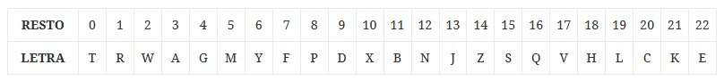

# UT03. Objetos y tipos de datos

## Objetos

### PR0301: Objetos (I)

Crea una función `cloneObject(obj)` que tome un objeto como parámetro y devuelva una copia del mismo.

---

### PR0302: Objetos (II)

Crea una función llamada `mergeObjects()` que emule la función `Object.assign()` (por supuesto, sin utilizar esta función). Deberá recoger dos objetos como parámetros y devolver otro objeto que contenga las propiedades de los dos objetos recibidos.

---

### PR0303: Objetos (III)

Crea una función llamada `intersectObjects()` que recoja dos objetos como parámetros y devuelva un objeto que contenga solamente las propiedades que tengan el mismo nombre en ambos objetos. El valor que se asigne a estas propiedades es indiferente.

--- 

### PR0304: Objetos (IV)

Crea una función llamada `containsObject(a, b)` que devuelve `true` si todas las propiedades del objeto `b` existen en el objeto `a` y `false` en caso contrario. El valor de las propiedades es indiferente.

--- 

### PR0305: Objetos (V)

Crea una función llamada `removeUndefined(a)` que tome como parámetro un objeto y devuelva una copia del mismo en el que se han eliminado todas las propiedades cuyo valor sea `undefined`.

--- 

## Números

### PR0306: Números (I)

Crea una función `convertBase( str, baseFrom, baseTo )` que tome como parámetro una cadena `str` que contiene un número en base `baseFrom` y devuelva una cadena con el número en base `baseTo`.

---

## Cadenas

### PR0307: Cadenas (I)

Crea una función `countVowels(str)` que tome como parámetro una cadena (que solo contendrá letras y espacios) y devuelva el número de vocales que tenga, ignorando mayúsculas y minúsculas.

Supondremos que la cadena de entrada no incluye caracteres no anglosajes, como tildes o diéresis.

**Fuente**: [CodeWars: Vowel Count](https://www.codewars.com/kata/54ff3102c1bad923760001f3)

---

### PR0308: Cadenas (II)

Crea una función `countLetters(str)` que devuelva un objeto que contenga el número de veces que se repite cada letra. No se tendrán en cuenta los espacios y no se diferenciará entre mayúsculas y minúsculas.

Al igual que en el ejercicio anterior, supondremos que no habrá vocales con tildes, diéresis, ...

**Ejemplo**: 

```javascript
countLetters('DAW DWEC');       // { a: 1, c: 1, d: 2, e: 1, w: 2 }
countLetters('Hola mundo');     // { a: 1, d: 1, h: 1, l: 1, m: 1, n: 1, o: 2, u: 1}
```

**Fuente**: [CodeWars: Count characters in your string](https://www.codewars.com/kata/52efefcbcdf57161d4000091)

---

### PR0309: Cadenas (III)

Crea una función `removeVowels(str)` que tome como parámetro una cadena y devuelva una nueva cadena con todas las vocales eliminadas.

**Ejemplo**: 

```javascript
removeVowels('Hola mundo');     // 'Hl mnd'
removeVowels('IES Villabalter de San Andres');  // S Vllbltr d Sn ndrs
```

**Fuente**: [CodeWars: Disemvowel Trolls](https://www.codewars.com/kata/52fba66badcd10859f00097e)

---

### PR0310: Cadenas (IV)

Crea una función `replaceWithPosition(str)` que, dada una cadena, devuelva otra cadena en la que cada letra ha sido reemplazada por su posición en el alfabeto. Utilizaremos el alfabeto inglés, en el que no hay letra `ñ`.

**Ejemplo**: 

```javascript
replaceWithPosition('hola');    // '8 15 12 1'
```

**Fuente**: [CodeWars: Replace with Alphabet Position](https://www.codewars.com/kata/546f922b54af40e1e90001da)


---

### PR0311: Cadenas (V)

Crea una función `ascendDescend( len, min, max )` que devuelva una cadena formada por la secuencia de longitud `len` formada por la concatenación de números que comience en `min` y se incrementen hasta `max` para posteriormente decrementarse, repitiendo el ciclo hasta alcanzar la longitud `len`.

**Ejemplo**: 

```javascript
ascendDescend( 8, 2, 7 );   // 23456765
ascendDescend( 10, 2, 5 );  // 2345432345
```

**Fuente**: [CodeWars: Ascend, Descend, Repeat?](https://www.codewars.com/kata/62ca07aaedc75c88fb95ee2f)

---


## Arrays

### PR0315: Arrays (I)

Crea una función `sendMessage(arr)` que reciba como parámetro un array con nombres de usuarios y, para cada uno de ellos, muestre por consola una mensaje de la forma `Hola, <usuario>, bienvenido al curso de DWEC`.

---

### PR0316: Arrays (II)

Crea una función `getOdd(arr)` que reciba como parámetro un array con números y devuelva otro array que contenga únicamente los números del primer array que sean impares.

**Ejemplo**:

```javascript
getOdd([1, 4, 5, 34, 75, 2]);       // [1, 5, 75]
```

---

### PR0317: Arrays (III)

Crea un función `createPow( arr, pow )` cuyo primer parámetro sea un array de números y el segundo un número. Esta función devolverá un array donde cada elemento será el resultado de elevar cada uno de los elementos `arr` a `pow`.

**Ejemplo**:

```javascript
createPow( [1, 3, 5], 4 );          // [1, 81, 625]
createPow( [1, 2, 4, 9], 3 );       // [1, 8, 64, 729] 
```

---

### PR0318: Arrays (IV)

Crea una función `generateUsername(arr)` que tome como parámetro un array de objetos con las propiedades `name` y `surname` y añada a cada elemento una propiedad `nickname` cuyo valor será la primera letra del nombre seguida del apellido (todo en minúsculas) y dos dígitos aleatorios.

Ten en cuenta que `nickname` se tiene que añadir al mismo array y no crear uno nuevo.

**Ejemplo**:

```javascript
let arr = [
    {   name: 'Victor',
        surname: 'González',
    },
    {
        name: 'Pepe',
        surname: 'Pérez',
    }]
generateUsername( arr );        // [ {name: 'Victor', surname: 'González', nickname: 'vgonzalez73'},
                                //   {name: 'Pepe', surname: 'Pérez', nickname: 'pperez25'} ]
```

---

### PR0319: Arrays (V)

Crea una función `max( arr )` que recoja un array de números y devuelva el valor máximo. Este ejercicio es para practicar con la función `reduce`, por lo que debes utilizar esta función para hacerlo.

--- 

### PR0320: Arrays (VII)

Vamos a suponer que tenemos un arrays con cadenas que incluyen fechas de la forma `DD-MM-YYYY` donde `DD` es el día, `MM` es el mes y `YYYY` es el año. Desarrolla una función `sortDates( arr )` que devuelva un array con las mismas fechas ordenadas cronológicamente. El objetivo de este ejercicio es prácticas con la manipulación de cadenas y métodos de arrays, por lo que no debes utilizar las funciones de JavaScript para trabajar con fechas.

**Ejemplo**:

```javascript
sortDates( ['24-05-2020', '02-12-2018', '14-02-2020'] );    // ['02-12-2018', '14-02-2020', '24-05-2020']
```


---

## Arrays de objetos

En los ejercicios anteriores hemos trabajado con arrays de primitivas, pero es muy común trabajar sobre arrays de objetos, siendo ahí donde mayor relevancia tienen todas las funciones que hemos visto. 

En los siguientes ejercicios trabajaremos con una estructura de datos como la siguiente. Se han añadido 2 campos de ejemplo pero puedes añadir más elementos al array para hacer pruebas. 

```javascript
let arr = [
    {
        nombre: 'Pepe',
        ape1: 'Pérez',
        ape2: 'López',
        dni: '10100100',
        expediente: '1720',
        pass: '1234ABC',
        ciclo: 'DAW',
        notas: {
            DWEC: 7.8,
            DIW: 5.4,
            DWEC: 9.4
        }
    },
    {
        nombre: 'Juan',
        ape1: 'Mázquez',
        ape2: 'Hernández',
        dni: '7340831',
        expediente: '342',
        pass: 'P@ssw0rd',
        ciclo: 'DAW',
        notas: {
            DWEC: 8,
            DIW: 5.2,
            DWES: 4
        }
    }
]

```

### PR0324: Arrays de objetos (I)

Al introducir los datos alguien se olvidó de añadir la letra al DNI. Crea una función `addNif(arr)` que modifique el array que se le pase añadiendo una propiedad `nif` que contenga el NIF (DNI+letra) y elimine la propiedad `dni`. 

Para calcular la letra del NIF simplemente hay que calcular el resto cuando se divide el número del DNI entre 23 y se asigna la letra según la siguiente tabla. Se explica con más detalle [aquí](https://www.letranif.com/formula-para-calcular-nif/).



---

### PR0325: Arrays de objetos (II)

Crea una función `getAverageGrade( str )` que recoja como parámetro el nombre de un módulo y devuelva la nota media de dicho módulo.

**Ejemplo**:

```javascript
getAverageGrade( 'DIW' );       // 5.3
```

---

### PR0326: Arrays de objetos (III)

Crea una función `getAlumnosByCiclo(str)` que tome como parámetro una cadena `str` que contenga el nombre de un ciclo y devuelva el listado de alumnos que cursan dicho ciclo. Para cada alumno devolverá su nombre y apellidos.

**Ejemplo**:

```javascript
getAlumnosByCiclo( 'DAW' );     // [ 'Pepe Pérez López', 'Juan Márquez Hernández' ] 
```

---

### PR0327: Array de objetos (IV)

Crea una función `getNumberOfAlumnos( str )` que tome como parámetro el nombre de un ciclo y devuelva el número de alumnos que hay matriculados en dicho ciclo.

**Ejemplo**:

```javascript
getNumberOfAlumnos('DAW');      // 2
```

---

### PR0328: Array de objetos (V)

Vamos a generar para cada alumno un nombre de usuario formado por el nombre y la primera letra de cada uno de los apellidos, todo en minúsculas. Crea una función llamada `getUsernames()` que devuelva un array con los nombres de usuario generados para cada uno de los alumnos.

**Ejemplo**:

```javascript
getUsernames();     // [ 'pepegl', 'juanmh' ]
```

---

### PR0329: Array de objetos (VI)

Crea una función llamada `getAverages()` que calcule para cada alumno la nota media de todos los módulos que ha cursado. Debe devolver un array de la forma `{ alumno: 'XXX YYY', expediente: 'ZZZZ', nota_media: 00 }`

--- 

### PR0330: Array de objetos (VII)

Crea una una función `getUnsecurePass()` que devuelva un array con los nombres y apellidos de los alumnos que tengan una contraseña que no cumpla los requisitos de complejidad. Estos requisitos son:

- Debe tener por lo menos un carácter en mayúsculas y uno en minúsculas
- Debe tener por lo menos un dígito
- Debe tener una longitud mínima de 8 caracteres

---


