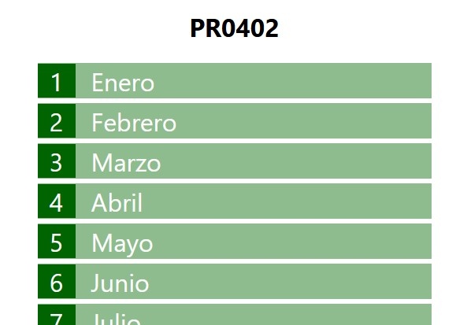
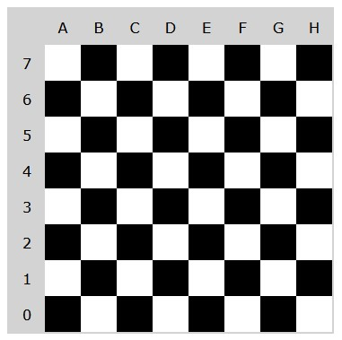

# UT04. Document Object Model. DOM

## Prácticas básicas de manipulación del DOM


### PR0401: DOM(I)

En esta práctica tienes que crear la siguiente página Web, pero generándola con JavaScript.


Para ello partes de este código HTML.

```html
<h1>PR0401</h1>
<div id="numbers"></div>
```

Y la idea es que se genere automáticamente mediante JavaScript algo así:

```html
<div id="numbers">
    <span class="number">1</span>
    <span class="number">2</span>
    <span class="number">3</span>
</div>
```

Puedes utilizar la hoja de estilos que tienes [aquí](assets/files/pr0401.css), aunque no sería mala idea que intentaras hacerlos tú directamente para ir practicando.

---

### PR0402: DOM (II)

Vamos a hacer algo más elaborado, en esta ocasión debes generar mediante JavaScript una página como la siguiente (por brevedad se ha recordato pero incluirá los 12 meses):



Igual que en la anterior práctica partes del armazón HTML:

```html
    <h1>PR0402</h1>
    <div id="months"></div>
```

Y el código que generarás será de la forma:

```html
    <h1>PR0402</h1>
    <div id="months">
        <div class="month">
            <div class="month-number">1</div>
            <div class="month-name">Enero</div>
        <div>
        <!-- Igual para todos los meses -->
    </div>
```

Puedes descargar el archivo CSS desde [aquí](assets/files/pr0402.css), aunque nuevamente te recomiendo que intentes hacerlo por tu cuenta.

---

### PR0403: DOM (III)

Añade un script a la página que puedes encontrar [aquí](assets/files/pr0403.html) que muestre la siguiente información en los elementos `<div>` el final:

- Número de párrafos que hay en la página
- Dirección a la que enlaza el penúltimo enlace
- Número de enlaces que apuntan a https://google.es
- Número de palabras del segundo párrafo

---

### PR0404: DOM (IV)

Supón que vamos a realizar un juego de ajedrez y, por supuesto, el primer paso será crear el tablero y lo vamos a crear completamente con JavaScript. Para ello partes la siguiente estructura HTML:

```html
<body>
    <h1>Tablero de Ajedrez</h1>
    <div id="board"></div>
</body>
```

En este ejercicio también deberás aplicar el CSS y decidir cual será la estructura del HTML que vas a construir, aunque tienes que seguir las siguientes normas:

- Las celdas tendrán un tamaño de 80x80 píxeles
- En un tablero de ajedrez, las celdas se localizan mediante sus coordenadas, identificando las columnas con letras entre la A y la H y las filas con un número entre 0 y 7.
- Estas coordenadas deben estar guardadas en el HTML para poder hacer referencia individualmente a cada celda. Aquí tienes dos opciones:
  - Utilizar un atributo id único de la forma `<span class="cell" id="A4">`
  - O bien utilizar un atributo *data-*, por ejemplo, `<span class="cell" data-coord="A4">`
- Puedes utilizar todas las clases y atributos que consideres necesarios.
- Las cabeceras con las coordenadas de cada celda las puedes dejar para el final, ya que probablemente sea lo más complicado de la práctica.

El resultado final podría ser como el de la siguiente imagen:



---

### PR0405: DOM (V)

Partiendo del siguiente documento HTML:

```html
<body>
    <h1>Crear enlaces</h1>
    <ul>
        <li>Google</li>
        <li>DuckDuckGo</li>
        <li>Bing</li>
        <li>Ecosia</li>
        <li>WolframAlpha</li>
    </ul>
</body>
```

Crea un script HTML que recorra la página y, en cada uno de los elementos de la lista añada un enlace al buscador correspondiente.

Las URLS son:
- Google: https://google.com
- DuckDuckGo: https://duckduckgo.com
- Bing: https://www.bing.com
- Ecosia: https://www.ecosia.org/
- WolframAlpha: https://www.wolframalpha.com/

---

### PR0406: DOM (VI)

Crea una página Web que únicamente contenga un botón y, cada vez que se pulse dicho botón, se cambie el color de fondo de la página por un color aleatorio.

---

### PR0407: DOM (VII)


### PR04XX: ToDo App: aplicación para guardar tareas (I)

Tienes que realizar una pequeña aplicación para mostrar notas en pantalla. Por ahora la funcionalidad es muy sencilla, únicamente debe tener un campo de formulario para introducir las tareas y un botón para agregarlas. Al pulsar el botón se mostrarán en la parte inferior de la pantalla.

En el siguiente vídeo puedes ver la funcionalidad básica de la aplicación.

<video width="640" controls>
    <source src="assets/videos/todo_01.mp4" type="video/mp4">
    Tu navegador no soporta la reproducción de vídeo
</video>

Algunas consideraciones a tener en cuenta:

- Debes tener un array para almacenar los valores introducidos por el usuario.
- En esta primera práctica se facilita la estructura HTML y CSS para que te centres únicamente en el JavaScript. Puedes descargar el HTML de [aquí](assets/files/PR04XX.html) y el CSS desde [esta ubicación](assets/files/PR04XX.css).


## PR04XX: ToDo App: aplicación para guardar tareas (II)