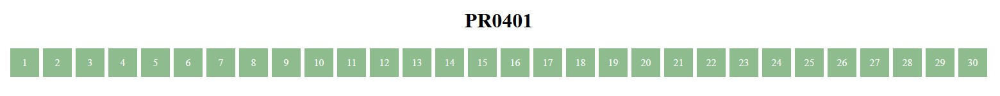
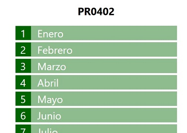
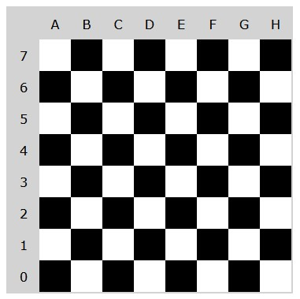
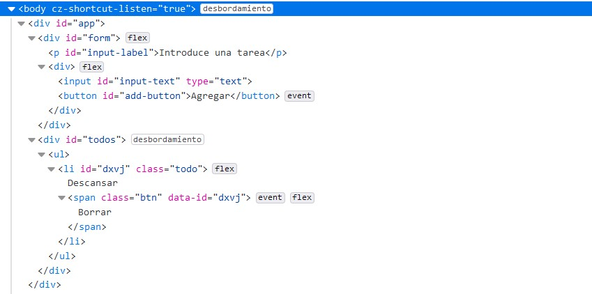

# UT04. Document Object Model. DOM

## Prácticas básicas de manipulación del DOM


### PR0401: Generación de elementos DOM con JavaScript (I)

En esta práctica tienes que crear la siguiente página Web, pero generándola con JavaScript.



Para ello partes de este código HTML.

```html
<h1>PR0401</h1>
<div id="numbers"></div>
```

Y la idea es que se genere automáticamente mediante JavaScript algo así:

```html
<div id="numbers">
    <span class="number">1</span>
    <span class="number">2</span>
    <span class="number">3</span>
</div>
```

Puedes utilizar la hoja de estilos que tienes [aquí](assets/pr0401/pr0401.css), aunque no sería mala idea que intentaras hacerlos tú directamente para ir practicando.

---

### PR0402: Generación de elementos DOM con JavaScript (II)

Vamos a hacer algo más elaborado, en esta ocasión debes generar mediante JavaScript una página como la siguiente (por brevedad se ha recordato pero incluirá los 12 meses):



Igual que en la anterior práctica partes del armazón HTML:

```html
    <h1>PR0402</h1>
    <div id="months"></div>
```

Y el código que generarás será de la forma:

```html
    <h1>PR0402</h1>
    <div id="months">
        <div class="month">
            <div class="month-number">1</div>
            <div class="month-name">Enero</div>
        <div>
        <!-- Igual para todos los meses -->
    </div>
```

Puedes descargar el archivo CSS desde [aquí](assets/pr0402/pr0402.css), aunque nuevamente te recomiendo que intentes hacerlo por tu cuenta.

---

### PR0403: Obteniendo información del DOM

Añade un script a la página que puedes encontrar [aquí](assets/pr0403/pr0403.html) que muestre la siguiente información en los elementos `<div>` del final:

- Número de párrafos que hay en la página
- Dirección a la que enlaza el penúltimo enlace
- Número de enlaces que apuntan a https://google.es
- Número de palabras del segundo párrafo

---

### PR0404: Creación de HTML con JavaScript

Supón que vamos a realizar un juego de ajedrez y, por supuesto, el primer paso será crear el tablero y lo vamos a crear completamente con JavaScript. Para ello partes la siguiente estructura HTML:

```html
<body>
    <h1>Tablero de Ajedrez</h1>
    <div id="board"></div>
</body>
```

En este ejercicio también deberás aplicar el CSS y decidir cual será la estructura del HTML que vas a construir, aunque tienes que seguir las siguientes normas:

- Las celdas tendrán un tamaño de 80x80 píxeles
- En un tablero de ajedrez, las celdas se localizan mediante sus coordenadas, identificando las columnas con letras entre la A y la H y las filas con un número entre 0 y 7.
- Estas coordenadas deben estar guardadas en el HTML para poder hacer referencia individualmente a cada celda. Aquí tienes dos opciones:
  - Utilizar un atributo id único de la forma `<span class="cell" id="A4">`
  - O bien utilizar un atributo *data-*, por ejemplo, `<span class="cell" data-coord="A4">`
- Puedes utilizar todas las clases y atributos que consideres necesarios.
- Las cabeceras con las coordenadas de cada celda las puedes dejar para el final, ya que probablemente sea lo más complicado de la práctica.

El resultado final podría ser como el de la siguiente imagen:



---

### PR0405: DOM (V)

Partiendo del siguiente documento HTML:

```html
<body>
    <h1>Crear enlaces</h1>
    <ul>
        <li>Google</li>
        <li>DuckDuckGo</li>
        <li>Bing</li>
        <li>Ecosia</li>
        <li>WolframAlpha</li>
    </ul>
</body>
```

Crea un script HTML que recorra la página y, en cada uno de los elementos de la lista añada un enlace al buscador correspondiente.

Las URLS son:
- Google: https://google.com
- DuckDuckGo: https://duckduckgo.com
- Bing: https://www.bing.com
- Ecosia: https://www.ecosia.org/
- WolframAlpha: https://www.wolframalpha.com/

---

### PR0406: DOM (VI)

En esta práctica parte de una página web como la siguiente:


Realiza los pasos necesarios para que cada vez que el usuario pulse el bóton se desplacen las imágenes una posición a la derecha (la de imagen de la derecha del todo pasará a ser la primera imagen).

Recursos:

- [HTML](assets/pr0406/pr0406.html)
- [CSS](assets/pr0406/pr0406.css)

---

### PR0407: DOM (VII)

Modifica la página del ejercicio anterior para que cada vez que se pulse el botón se reordenen aleatoriamente las imágenes.

---

### PR0410: Listeners básicos 

Crea una página Web que únicamente contenga un botón y, cada vez que se pulse dicho botón, se cambie el color de fondo de la página por un color aleatorio.


---

### PR0411: ToDo App (I)

Tienes que realizar una pequeña aplicación para mostrar notas en pantalla. Por ahora la funcionalidad es muy sencilla, únicamente debe tener un campo de formulario para introducir las tareas y un botón para agregarlas. Al pulsar el botón se mostrarán en la parte inferior de la pantalla.

En el siguiente vídeo puedes ver la funcionalidad básica de la aplicación.

<video width="640" controls>
    <source src="assets/videos/todo_01.mp4" type="video/mp4">
    Tu navegador no soporta la reproducción de vídeo
</video>

Algunas consideraciones a tener en cuenta:

- Debes tener un array en el que irás almacenando todas las tareas realizadas por el usuario.
- Cada vez que el usuario haga click en el botón de *Agregar* añades el contenido del campo de texto al array y llamas a una función que genere el HTML a partir del contenido del array.
- Recursos:
  - [HTML](assets/pr0411/pr0411.html)
  - [CSS](assets/pr0411/pr0411.css)

---

## PR0412 ToDo App: aplicación para guardar tareas (II)

Vamos a mejorar la aplicación del ejercicio anterior añadiendo un botón para poder eliminar cada tarea. En el siguiente vídeo puedes ver la aplicación en funcionamiento.

<video width="640" controls>
    <source src="assets/videos/todo_02.mp4" type="video/mp4">
    Tu navegador no soporta la reproducción de vídeo
</video>

Cosas que tienes que tener en cuenta:

- Cada botón tiene que tener su propio *listener*, así que cada vez que añadimos un elemento a la lista deberíamos:
  - Crear el elemento `<li>` con el texto de la tarea
  - Crear el botón, asociarle el *listener* e insertarlo en el elemento `<li>`
  - Añadir el elemento `<li>` a la lista
- Un problema que vas a encontrar es que desde la función activada por el *listener* puedes obtener toda la información del nodo correspondiente al botón, pero, ¿cómo sabes cuál es el elemento `<li>` que corresponde a dicho nodo? Una posible solución puede ser asignar a cada elemento `<li>` un atributo `id` único (por ejemplo una cadena aleatoria de 4 caracteres) y almacenar esa información también en el botón mediante un atributo `data-`.
- Ese mismo identificador también te puede servir para localizar las tareas en el array guardado en memoria con todas las tareas, aunque esto obligará a que el array de tareas, en lugar de ser un array de cadenas, deberá ser un array de objetos, cada uno de ellos con una propiedad con el identificador y otra con el texto de la tarea.
- Recursos:
  - [CSS](assets/pr0412/pr0412.css)

Si utilizas la hoja de estilos facilitada ten en cuenta las clases y estructuras que utilices tiene que ser como se muestra en la siguiente imagen:



---

## PR0413 ToDo App: aplicación para guardar tareas (III)

Vamos a seguir mejorando la aplicación realizando los siguiente:

- Añade un botón en la parte inferior que permita vaciar la lista de tareas.
- Añade un botón en cada tarea, junto al botón de eliminar, que permita marcar una tarea como hecha. Las tareas marcadas como *hecha* se mostrarán visualmente con el fondo de otro color y el texto de la tarea tachado (propiedad CSS `text-decoration: line-through`). La función de este botón será de tipo *switch*, es decir, si no está marcada la marcará y si sí lo está la desmarcará.


<video width="640" controls>
    <source src="assets/videos/todo_03.mp4" type="video/mp4">
    Tu navegador no soporta la reproducción de vídeo
</video>