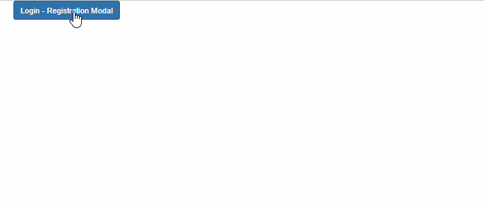

# UT05. Eventos y formularios

## Eventos del ratón

### PR0501: Captura de eventos del ratón (I)

Crea una página web que contendrá una lista y añádele funcionalidad con JavaScript para que los elementos sean seleccionables de forma análoga a como se seleccionan en el explorador de archivos:

- Si se hace click en un elemento se selecciona ese y se deseleccionan los demás
- Si se hace click en un elemento ya seleccionado se deselecciona
- Si se hace Ctrl-Click en un elemento se selecciona/deselecciona sin modificar los demás

La selección de los elementos la puedes realizar añadiendo una clase `.selected` que tenga asociado un color de fondo diferente en CSS.

Evita también la selección nativa del navegador en los clicks.

---

### PR0502: Captura de eventos del ratón (II)

Diseña una página web en la que se mostrará una cuadrícula de 10x10 donde cada celda estará numerada con números consecutivos del 1 al 100.

Programa el comportamiento de la página para que:

- Cada vez que el usuario haga click sobre una casilla se seleccione (marcándola de otro color). Si la casilla ya está seleccionada se deselecciona (volviendo a quedar de color blanco).
- Si el usuario hace click con el botón derecho del ratón la casilla se marca de color rojo y ya no podrá volver a modificarse.

---

### PR0503: Captura de eventos del ratón (III)

Modifica la práctica que realizamos en la unidad anterior para que cada vez que el usuario haga click en una casilla se muestre en alguna parte de la pantalla las coordenadas de la casilla en la que se ha hecho click.

---

### PR0504: Captura de eventos del ratón (IV)

Vamos a hacer un pequeño juego que nos servirá para mejorar nuestros conocimientos de los eventos del ratón. El juego simplemente consistirá en mostrar una serie de recuadros por pantalla y esperar a que el usuario haga click en ellos. Cada vez que hace click en un recuadro se incrementa un contador de puntuación en 1 y se redibuja el recuadro con diferente tamaño en otra posición de la pantalla.

Una versión muy básica del juego la puedes ver en el siguiente vídeo:

<video width="640" controls>
    <source src="assets/videos/pr0504.mp4" type="video/mp4">
    Tu navegador no soporta la reproducción de vídeo
</video>

Algunas pautas a seguir para realizar esta práctica:

- La idea es simple, creas un elemento HTML con un *listener* que, cuando recoge un click incrementa el contador y cambia la posición y tamaño del elemento.
- Para calcular la posición del elemento tienes que tener conocimiento del tamaño de la ventana del navegador. Este valor lo puedes conocer mediante las propiedades `window.innerWidth` y `window.innerHeight`.
- Un problema que encontrarás es que el tamaño de la ventana puede modificarse mientras el usuario está jugando. Afortunadamente, esto también lanza un evento llamado `resize` y que debes capturar en el objeto `window`.

---

### PR0505: Captura de eventos del ratón (V)

Vamos a mejorar el programa anterior. Para ello, en esta práctica tienes que realizar por los menos 3 de las siguientes mejoras propuestas.

- Incluye un botón que permita reiniciar el contador a cero.
- Añade un selector que servirá para seleccionar la dificultad, a mayor dificultad menor será el tamaño medio de los recuadros.
- Añade un cronómetro que limitará el tiempo que tiene el usuario
- Crea un ranking de los usuarios con las mejores puntuaciones, para ello, el usuario deberá poder introducir su nombre antes de poder darle al botón de Start.
- Añade un efecto psicodélico, haz que, cada vez que cambie de posición el recuadro cambie el color del mismo y también el del fondo de la ventana.

Como vas a hacer algo un poco más complejo, estaría bien que prepararas una interfaz más completa. Puedes hacerla como quieras, pero si necesitas un poco de inspiración en la siguiente imagen tienes una sugerencia de cómo podría ser:

**Consejos para trabajar con tiempo en JavaScript**

Probablemente, de todas las mejoras la que más dificultad tiene es la del establecimiento de un tiempo. Para ello necesitarás dos funciones que no hemos visto aún: [`setInterval`](https://developer.mozilla.org/es/docs/Web/API/setInterval) y [`setTimeout`](https://developer.mozilla.org/es/docs/Web/API/setTimeout). La primera permite ejecutar una función función cada cierto tiempo mientras que la segunda permite establecer un tiempo de espera tras el cual se ejecutará una función indicada una única vez.

En este caso necesitarás la primera. Básicamente, la idea será:

- Suponemos que el tiempo de juego es, por ejemplo, de 20 segundos.
- Establecemos un contador a cero que se mostrará en pantalla.
- Creamos un intervalo que ejecutará una función cada segundo.
- La función incrementará el contador en uno y comprueba que no haya llegado hasta 20.
- Cuando el contador llegue a 20 se limpia el intervalo con la función [`clearInterval`](https://developer.mozilla.org/es/docs/Web/API/clearInterval) y se muestra la puntuación del jugador.

**Recursos**

Si prefieres centrarte en JavaScript y no tener que preocuparte por CSS, puedes descargarki de aquí:

- [HTML](assets/pr0505/index.html)
- [CSS](assets/pr0505/style.css)

---

### PR0506: Captura de eventos del teclado

Ahora que ya estarás familiarizado con los eventos del ratón, vamos a incluir los eventos del teclado. Para ello, vas a implementar el **juego del ahorcado** donde el usuario podrá indicar cada una de las letras tanto a través del teclado como utilizando un teclado virtual en pantalla.

El resultado final puede ser algo parecido a lo que se muestra en el siguiente vídeo:

<video width="640" controls>
    <source src="assets/videos/pr0506.mp4" type="video/mp4">
    Tu navegador no soporta la reproducción de vídeo
</video>

**Consejos para realizar la práctica**

- Las palabras las puedes objener del fichero indicado en recursos, que tiene un listado de palabras en castellano con más de 7 letras.
- Tambien en recursos dispones de imágenes para los diferentes estados del dibujo, aunque puedes cambiarlo si quieres.
- Lo ideal es que todos los eventos que recojas (pulsación de tecla, click, ...) se gestionen desde una misma función en la que se mirará el tipo de evento para ver de donde obtener la letra seleccionada (si es una pulsación de tecla estará en la propiedad `key` o `code`, mientras que si se trata de una pulsación se deberá obtener del atributo personalizado del elemento que recogió el evento).
- Puedes ejercitar tus conocimientos de CSS o, si quieres centrarte en la lógica, utilizar el fichero CSS que se encuentra en recursos.

**Recursos**

- [Listado de palabras](assets/pr0506/words.js)
- [Imágenes](assets/pr0506/imgs/hangman.zip)
- [CSS](assets/pr0506/style.css)
- [Estructura HTML](assets/pr0506/index.html)

## Formularios

### PR0507: Formularios (I)

Algo habitual cuando creamos una cuenta en algún servicio es que se nos muestre de alguna forma el nivel de seguridad de la contraseña teniendo en cuenta criterios como la longitud o el número de tipos diferentes de caracteres (mayúsculas, minúsculas, dígitos, ...).

Crea una página con un formulario que tendrá tres campos: correo electrónico, contraseña y repetir contraseña, así como el botón para enviar. Tienes que realizar las siguientes validaciones:

- El correo electrónico deberá contener por lo menos una `@` y un `.`, si no los tiene se debe mostrar un mensaje indicando que el correo no es válido (cuando pierda el foco). Como se trata de hacerlo en JavaScript, no puedes utilizar el atributo `type="email"`, sino que tienes que leerlo como texto.
- A medida que el usuario vaya introduciendo la contraseña se mostrará de alguna forma la seguridad de la misma (muy débil, débil, aceptable, fuerte, muy segura).
- Si los valores de los campos de contraseña y repetir contraseña no son iguales se deberá mostrar de alguna manera.
- Cuando el usuario pulse el botón de enviar se mostrará por consola el correo electrónico y la contraseña del usuario.
- En la siguiente imagen puedes hacerte una idea de como dividir los tipos de contraseñas según la seguridad. Fuente: [digg.com](https://digg.com/technology/link/how-long-it-takes-to-get-password-hacked-1IvDFspF6p)

[Contraseñas](assets/pr0507/bruteforce.png)

---

### PR0508: Formularios (II)

Algo que seguro que has visto en muchos formularios es que, en función del valor de determinado campo, aparecen otros campos en el formulario o bien se rellenan con datos determinados por el valor introducido en el primer campo.

Por ejemplo, las siguientes capturas corresponden al formulario de recogida de datos de [Red SARA](https://rec.redsara.es). Ahí se puede ver que el selector para introducir la provincia se rellena una vez que se ha escogido un país, y, a su vez, el selector para la localidad se rellena cuando se ha escogido una provincia.

En esta práctica tienes que hacer un formulario que imite ese comportamiento. Las características del mismo serán:

- El formulario tendrá tres selectores (comunidad autónoma, provincia y localidad) y un botón de enviar.
- En la web del INE tienes un listado con todas las localidades de España clasificadas por provincias. En esta práctica es suficiente con que consideres unas pocas localidades, pero tienes que hacerla pensando en que hay más de 8000 localidades en España y que la aplicación que hagas debería poder escalarse hasta esa cantidad.
- Teniendo en cuenta el punto anterior, lo primero en lo que tienes que pensar es en el tipo de datos que vas a utilizar para almacenar la relación de comunidades, provincias y localidades.
- Puedes hacer como en las imágenes anteriores, en las que el selector se encuentra vacío hasta que se rellena con los datos correspondientes, o mantener oculto el selector y mostrarlo cuando ya tenga datos.

---

### PR0509: Formularios (III)

Vamos a hacer una ventana de login o registro que se muestre en una **ventana modal**. Una ventana modal es un cuadro de diálogo que se muestra en pantalla sobre la página, normalmente oscureciéndola para centrar la atención en el contenido de la ventana modal.

