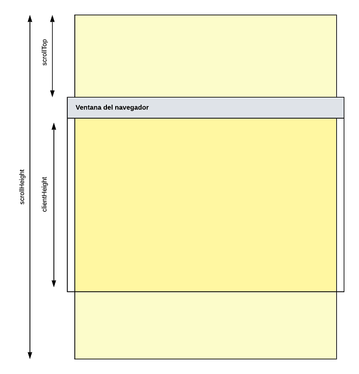

# UT05. Eventos y formularios (Opcionales)

## Eventos de ratón y teclado

### OPT0501: Scroll infinito

**<span style="color: #ED7117">📣 Opcional</span>**

Un efecto que vemos habitualmente en muchas páginas web es el **scroll infinito**, que consiste en ir cargando de forma dinámica los contenidos de la página a medida que se va haciendo scroll.

Para realizar este efecto hay que tener encuenta algunas propiedades del nodo DOM que contiene todo el documento, es decir, el que corresponde a la etiqueta `<html>`. Podemos acceder a este nodo con la propiedad `document.documentElement`. Las propiedades que nos interesan son:

- `element.scrollHeight`: contiene la altura (en píxeles) del contenido del elemento, incluyendo el contenido que no es visible en la pantalla.
- `element.scrollTop`: indica el número de píxeles que el contenido del elemento ha sido desplazado hacia arriba, es decir, la distancia desde el límite superior de un elemento al límite superior de su contenido visible.
- `element.clientHeight`: devuelve la altura del elemento en píxeles.



Teniendo esto en cuenta el proceso es muy sencillo:

- Se carga una parte de la página, por ejemplo, si es un blog tres o cuatro artículos, o si es una galería de imágenes las primeras imágenes.
- Asociamos un *listener* al evento **`scroll`** del objeto `window`
- Cada vez que se activa el evento comprobamos si el usuario está visualizando la parte inferior del documento. Esto lo podemos saber cuando `scrollTop + clientHeight` se esté acercando a `scrollHeight`.
- En ese momento cargamos los siguientes elementos y los añadimos al final de la página, lo que modificará el tamaño de `scrollHeight`, por lo que volvemos a empezar.
- Antes de cargar los siguientes elementos puedes añadir un GIF de carga al final de la página para que el usuario tenga algún tipo de realimentación que le indique que se están cargando más elementos.


Ahora pon en práctica esto creando una pequeña página que muestre un scroll infinito. Vamos a suponer que queremos mostrar una **galería de fotos** que se irán mostrando infinitamente a medida que hagamos scroll.

Las fotos las vamos a obtener de [Lorem Picsum](https://picsum.photos/), una página web que permite obtener fácilmente fotos aleatorias para nuestros diseños, simplemente tienes que invocar la URL `https://picsum.photos/X/Y` para obtener una foto aleatoria de X píxeles de ancho e Y píxeles de alto. Si tienes dudas en la propia página web se explica su funcionamiento y las diversas opciones disponibles.

---

### OPT0502: Calculadora

Implementa una **calculadora** que pueda ser manipulada tanto con el teclado como con el ratón. Puedes añadirle todas las funciones que quieras, pero por lo menos debería poder realizar las operaciones básicas de suma, resta, multiplicación y división.

---

### OPT0503: Puzzle 15

Este juego consiste en un tablero de 4x4 piezas con un hueco. Cada una de las piezas está numerada del 1 al 15 y, al iniciar el juego, están desordenadas. El objetivo es ordenar numéricamente todas las piezas para lo que solo podremos mover las que estén adyacentes al hueco, pasando a ocupar este.

Implementa este juego en JavaScript, para lo que tienes que tener en cuenta lo siguiente:

- Se jugará con el ratón, cuando el usuario hace click en una celda adyacente al hueco se desplazará dicha celda al hueco.
- Puedes agregar *listeners* a todas las celdas y verificar si tiene celda adyacente al recibir el click del usuario o bien colocar el *listener* únicamente en las celdas que están junto al hueco.
- Es importante escoger el tipo de datos adecuado para almacenar el contenido del tablero, lo más natural sería utilizar un array bidimensional, aunque puedes utilizar cualquier otra estructura si te sientes más cómodo con ella.
- Personalmente crearía las siguientes funciones para simplificar el programa:
  - `isAdjacent(a, b)`: dadas dos posiciones devuelve `true` si son adyacentes y `false` en caso contrario. El tipo de datos de `a` y `b` dependerá de la estructura de datos que utilices.
  - `swapCells(a, b)`: intercambia los valores de dos celdas.
- Un posible flujo de datos de la aplicación sería:
  1. Se genera un tablero aleatorio
  2. Se muestra el tablero por pantalla
  3. Se añade un *listener* a las celdas adyacentes al hueco
  4. Cuando el usuario hace click se intercambia la celda seleccionada por el hueco
  5. Se comprueba si las celdas están ordenadas, en caso afirmativo gana el usuario.
  6. Se eliminan todos los *listener* 
  7. Se vuelve al punto 2
- Si te apetece mejorar un poco el programa puedes poner un cronómetro que mida el tiempo que tarda el usuario en finalizar. Para esto necesitas dos cosas:
  - Primero debemos mostrar un cronómetro, lo cual ya vimos en una práctica anterior que se hace con `setInterval()`.
  - Para calcular el tiempo total podemos utilizar la clase `Date`, en concreto la función `getTime()` que devuelve la hora actual expresada en milisegundos desde el 1 de enero de 1970. La idea sería:

```javascript
const startTime = new Date();
// Aquí va todo el código del programa
const endTime = new Date();
const elapsedTime = endTime.getTime() - startTime.getTime();    // Tiempo transcurrido en milisegundos

```

---

### OPT0505: Caída de letras

Vamos a hacer un pequeño juego para comprobar la agilidad en mecanografía. Por la parte superior de la pantalla irán cayendo letras y el usuario deberá pulsar la tecla correspondiente antes de que lleguen a la parte inferior.

Algunas ideas a tener en cuenta:

- Lo primero que te preguntarás es cómo hacer para que algo se mueva por pantalla. Como la idea es utilizar lo que hemos aprendido hasta ahora lo haremos modificando el posicionamiento de un elemento `<div>`. Los pasos son los siguientes:
  - Creamos un elemento HTML con **posicionamiento relativo**. Recuerda que este tipo de posicionamiento permite situar al elemento HTML con respecto al elemento que lo contiene (que será el área de juego), esta posición la determinamos con los atributos CSS `top`, `bottom`, `left` y `right`.
  - En principio situamos el elemento fuera de la vista del usuario con un valor de `top` negativo.


TODO: Incompleto

---

### OPT0504: Velocidad en mecanografía


### OPT0506: ToolTip

Vamos a implementar un tooltip en JavaScript, un **tooltip** es el típico cuadradito con un texto que se muestra sobre el cursor al situarlo encima de un elemento con algún tipo de información sobre el mismo. Es muy sencillo crear tooltips con CSS con la pseudo-clase `hover`, pero si queremos tener más control sobre los mismos o sobre su contenido debemos recurrir a JavaScript.

Vamos a implementar la lógica para que se muestre automáticamente un tooltipo en todos los elementos de la página que tengan asignado un atributo `data-tooltip`, siendo el valor de dicho atributo lo que se mostrará dentro del tooltip.

Algunas ideas a tener en cuenta:

- Necesitarás utilizar los eventos `mouseover` y `mouseout`, añadiendo *listeners* para ambos tipos de evento a todos los elementos de la página que incluyan el atributo `data-tooltip`. Es decir, no hay que indicar expresamente qué elementos van a tener tooltip, sino que simplemente añadiendo el atributo `data-tooltip` ya se le aplica dicha funcionalidad al elemento.
- Al entrar el ratón en el elemento se creará un nuevo elemento con el contenido del tooltip. Hay que calcular la posición en que se encuentra el elemento para situar el tooptipo por encima de él (dejando 5 píxeles de espacio) y a ser posible centrado.
- Hay que tener en cuenta los tamaños del área de visualización para que el *tooltip* no sobresalga de los límites de la ventana.